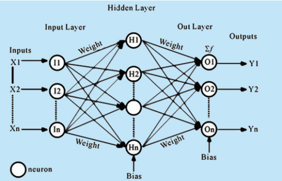
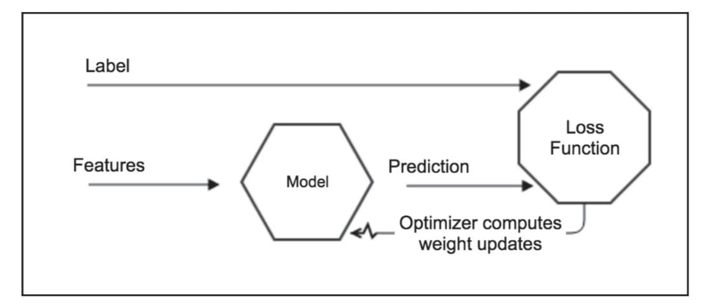

### Theory

Deep feedforward networks &mdash; often called feedforward neural networks or multilayer perceptrons (MLPs) &mdash; are fundamental models in deep learning. The goal of a feedforward network is to approximate some target function $f^*$. For example, for a classifier, $y = f(x)$ maps an input $x$ to a category $y$.

A layered feedforward network is one in which any path from an input node to an output node traverses the same number of layers. For example, the nth layer of such a network consists of all nodes that are n edge traversals from an input node. A hidden layer is any layer that is neither the input nor the output layer. A network is fully connected if each node in layer i is connected to all nodes in layer i+1. Layered feedforward networks have become popular because they often generalise well: when trained on a relatively sparse set of examples they frequently provide correct outputs on unseen test data.

When we use a feedforward neural network to accept an input $x$ and produce an output $\hat{y}$, information flows forward through the network. The input $x$ provides the initial information that then propagates to the hidden units at each layer and finally produces $\hat{y}$. This is called **forward propagation**.

During training, forward propagation continues until it produces a scalar cost $J(\theta)$. The **backpropagation algorithm** (Rumelhart et al., 1986), often simply called **backprop**, allows information from the cost to flow backwards through the network to compute gradients. The backpropagation algorithm that trains the feedforward neural network can often find a good set of weights (and biases) in a reasonable amount of time.

Backpropagation applies the **chain rule** to compute $\frac{\partial J}{\partial W^{(l)}}$ for every weight matrix $W^{(l)}$ in the network. For a multi-class classification task, the loss function is the **cross-entropy**:

$$J(\theta) = -\frac{1}{m} \sum_{i=1}^{m} \sum_{k=1}^{K} y_k^{(i)} \log \hat{y}_k^{(i)}$$

where $m$ is the number of training examples, $K$ is the number of classes, $y_k^{(i)}$ is the one-hot true label, and $\hat{y}_k^{(i)}$ is the predicted probability for class $k$.

The backward pass proceeds as follows. Let $z^{(l)} = W^{(l)} a^{(l-1)} + b^{(l)}$ be the pre-activation and $a^{(l)} = \rho(z^{(l)})$ the post-activation at layer $l$. The error signal at the output layer is:

$$\delta^{(L)} = \nabla_{a} J \odot \rho'(z^{(L)})$$

and for each hidden layer $l$ propagating backwards:

$$\delta^{(l)} = \left( W^{(l+1)T} \delta^{(l+1)} \right) \odot \rho'(z^{(l)})$$

The gradients with respect to weights and biases are then:

$$\frac{\partial J}{\partial W^{(l)}} = \delta^{(l)} \left(a^{(l-1)}\right)^T, \qquad \frac{\partial J}{\partial b^{(l)}} = \delta^{(l)}$$

These gradients tell the optimizer how much to adjust each weight. For example, with the Adam optimizer, the weight update at step $t$ is:

$$W^{(l)} \leftarrow W^{(l)} - \eta \cdot \hat{m}_t / (\sqrt{\hat{v}_t} + \epsilon)$$

where $\hat{m}_t$ and $\hat{v}_t$ are bias-corrected estimates of the first and second gradient moments. This minimises $J(\theta)$, reducing the prediction error over successive training epochs.

**Layer-by-Layer (MLP) Transformation:**

* **Input Layer:** Receives raw input $x$.
* **First Hidden Layer:** $h_1 = \rho(W_1 \cdot x + b_1)$ — applies a linear transformation followed by a nonlinearity.
* **Second Hidden Layer (if any):** $h_2 = \rho(W_2 \cdot h_1 + b_2)$ — further transforms the representation.
* **Output Layer:** $\hat{y} = \sigma(W_n \cdot h_{n-1} + b_n)$ — produces the final predictions (e.g., softmax probabilities).

More generally, the network can be expressed as a composition of functions:

$$\Phi(x) = \rho\!\left(W_n \cdot \rho\!\left(W_{n-1} \cdots \rho(W_1 \cdot x + b_1) \cdots + b_{n-1}\right) + b_n\right)$$

**Where:**

* $W_i \cdot a + b_i$ represents the linear transformation (weights and biases) for layer $i$.
* $\rho(\cdot)$ is the activation function applied element-wise (often the same across hidden layers).

In a feedforward neural network, the output from one layer is used as input to the next layer. Such networks are called **feedforward neural networks**. This means there are no loops in the network — information is always fed forward, never fed backward, as illustrated in Figure 1.

These models are called feedforward because information flows through the function being evaluated from x, through the intermediate computations used to define f, and finally to the output y. There are no feedback connections in which outputs of the model are fed back into itself.

1. **Gradient Based Learning:** For feedforward neural networks, it is important to initialise all weights to small random values; biases may be initialised to zero or to small positive values. Iterative gradient-based optimisation algorithms (e.g., SGD, RMSprop, Adam) are used to train feedforward networks and deepest models.

2. **Learning XOR:** To illustrate the capabilities of feedforward networks, consider the XOR function. XOR returns 1 when exactly one of x1 or x2 is 1, and 0 otherwise. Learning XOR demonstrates that an MLP with a hidden layer can represent non-linearly separable functions.

To make the idea of a feedforward network more concrete, we begin with an example of a fully functioning feedforward network on a very simple task: learning the XOR function. The XOR function ("exclusive or") is an operation on two binary values, $x_1$ and $x_2$. When exactly one of these binary values is equal to 1, the XOR function returns 1. Otherwise, it returns 0. The XOR function provides the target function $y = f^*(x)$ that we want to learn. Our model provides a function $y = f(x;\theta)$ and our learning algorithm will adapt the parameters $\theta$ to make $f$ as similar as possible to $f^*$.

 
*Figure 1: Architecture of Feedforward Neural Network*
*(Source: M. A. Nielsen, Neural Networks, and Deep Learning.)*

The process of forward propagation from input to output and backward propagation of errors is repeated several times until the error gets below a predefined threshold. The whole process is represented in the following diagram:

 
*Figure 2: MLP Process both Forward and Backpropagation*
*(Source: Antonio Gulli, Sujit Pal, Deep Learning with Keras)*

The forward and backward propagation process is repeated until the error falls below a predefined threshold. The model is updated to progressively minimise the loss function. In a neural network, individual neuron outputs matter less than the collective behaviour of weights in each layer as shown in Figure 2; the network adjusts its internal weights, so the prediction accuracy increases. Using appropriate features and high-quality labels is fundamental for reducing bias and improving learning.

**Merits of Feedforward Neural Network (MLP):**

* **Scalability:** The number of hidden layers and neurons can be adjusted to match problem complexity.
* **Performance on tabular data:** For many structured datasets, MLPs can outperform more complex models due to their simplicity and ability to learn direct features.
* **Universal function approximation:** MLPs can approximate virtually any continuous function, enabling them to model complex, non-linear relationships.

**Demerits of Feedforward Neural Network (MLP):**

* **Sensitivity to hyperparameters:** Performance depends heavily on choices such as number of layers, units, learning rate, and activation functions.
* **Overfitting:** MLPs can memorise training data and generalise poorly, especially with small datasets.
* **Gradient issues:** Very deep networks may encounter vanishing or exploding gradients, making training difficult.
* **Data requirements:** Large amounts of labelled data are often necessary to train effectively.