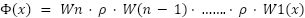
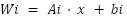
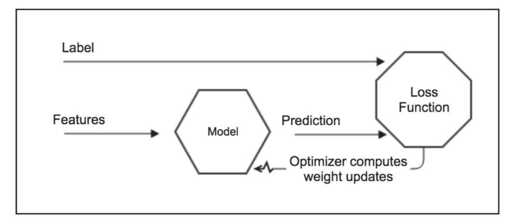

### Theory

## Introduction to Feedforward Neural Networks (MLPs)

Deep feedforward networks, also often called **feedforward neural networks**, or **multilayer perceptrons (MLPs)**, are the essential deep learning models. The goal of a feedforward network is to approximate some function f*. For example, for a classifier, `y = f*(x)` maps an input `x` to a category `y`.

A layered feedforward network is one such where any path from an input node to an output node traverses the same number of layers. The nth layer of such a network consists of all nodes which are n arc traversals from an input node.

A **hidden layer** is one which contains hidden nodes. Such a network is **fully connected** if each node in layer "I" is connected to all nodes in layer (i+1) for all "i". Layered feedforward networks have become very popular as they have been found in practice to generalize well, i.e. when trained on a relatively sparse set of data points, they will often provide the right output for the testing set.

## Information Flow in Feedforward Networks

When we use a feedforward neural network to accept an input `x` and produce an output `ŷ`, **information flows forward** through the network. The inputs `x` provides the initial information that then propagates up to the hidden units at each layer and finally produces `ŷ`. This is called **forward propagation**.

During training, forward propagation can continue onward until it produces a scalar cost of `J(θ)`. The **back-propagation algorithm** (Rumelhart et al., 1986a), often simply called **backprop**, allows the information from the cost to then flow backwards through the network, to compute the gradient.

## Backpropagation Algorithm

Backpropagation algorithm which operates the learning of the FNN, can often find a good set of weights (and biases) in a reasonable amount of time. Backpropagation is a variation in gradient search. It generally uses a least-squares optimal criterion. The key to backpropagation is a method for calculating the gradient of the error with respect to the weights for a given input by **propagating error backwards** through the network.

## Layer-by-Layer (MLP) Transformation

### Input Layer
Receives raw input `x`.

### First Hidden Layer

### Second Hidden Layer (if any)

### Output Layer

## General Formulation

This can be expressed more generally as a composition of functions:

**Where:**

- Represents the linear transformation (weights and biases) for layer i.

- Is the activation function (often the same across layers).

## Feedforward Architecture

> **Note:** Up to now, we've been discussing neural networks where the output from one layer is used as input to the next layer. Such networks are called **feedforward neural networks**. This means there are **no loops** in the network - information is always fed forward, never fed back.

These models are called feedforward because information flows through the function being evaluated from `x`, through the intermediate computations used to define `f`, and finally to the output `y`. There are no feedback connections in which outputs of the model are fed back into itself.

## Key Concepts

### 1. Gradient Based Learning

For feedforward neural networks, it is important to **initialize all weights to small random values**. The biases may be initialized to zero or to small positive values. The iterative gradient-based optimization algorithms used to train feedforward networks and almost all other deep models.

### 2. Learning XOR

To make the idea of a feedforward network more concrete, we begin with an example of a fully functioning feedforward network on a very simple task: learning the XOR function.

The **XOR function** ("exclusive or") is an operation on two binary values, x₁ and x₂. When exactly one of these binary values is equal to 1, the XOR function returns 1. Otherwise, it returns 0. The XOR function provides the target function `y = f*(x)` that we want to learn. Our model provides a function `y = f(x;θ)` and our learning algorithm will adapt the parameters `θ` to make `f` as similar as possible to `f*`.

## Network Architecture

**Figure 1 - Architecture of Feedforward Neural Network**  
*(Source: M. A. Nielsen, Neural Networks, and Deep Learning)*

## Forward and Backward Propagation Process

The process of forward propagation from input to output and backward propagation of errors is repeated several times until the error gets below a predefined threshold. The whole process is represented in the following diagram:

**Figure 2 - MLP Process both Forward and Backprop**  
*(Source: Antonio Gulli, Sujit Pal, Deep Learning with Keras)*

## Training Process

The features represent the input, and the labels are here used to drive the learning process. The model is updated in such a way that the **loss function is progressively minimized**. In a neural network, what really matters is not the output of a single neuron, but the **collective weights adjusted in each layer**.

Therefore, the network progressively adjusts its internal weights in such a way that the prediction increases the number of labels correctly forecasted. Of course, using the right set features and having **quality labeled data** is fundamental to minimizing the bias during the learning process.

---

## Merits of Feedforward Neural Network (MLP)

### **Scalability**
The number of hidden layers and neurons can be adjusted to fit the complexity of the problem.

### **Performance on Tabular Data**
In many research contexts, particularly with structured or tabular datasets, MLPs outperform complex models like Transformers due to their simplicity and ability to learn direct features.

### **Universal Function Approximation**
MLPs can approximate virtually any continuous function, allowing them to model highly complex, non-linear relationships.

---

## Demerits of Feedforward Neural Network (MLP)

### **Sensitivity to Hyperparameters**
Performance heavily depends on carefully choosing the number of layers, nodes, learning rates, and activation functions.

### **Overfitting**
MLPs are prone to learning training data too well, resulting in poor generalization of unseen data, especially with smaller datasets.

### **Gradient Issues**
Deep networks can encounter vanishing or exploding gradients, making training difficult.

### **Data Requirements**
They require large amounts of labeled data to train effectively.